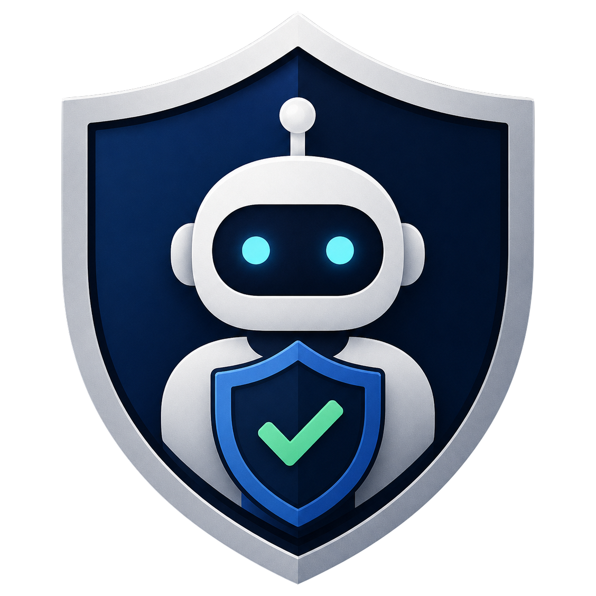
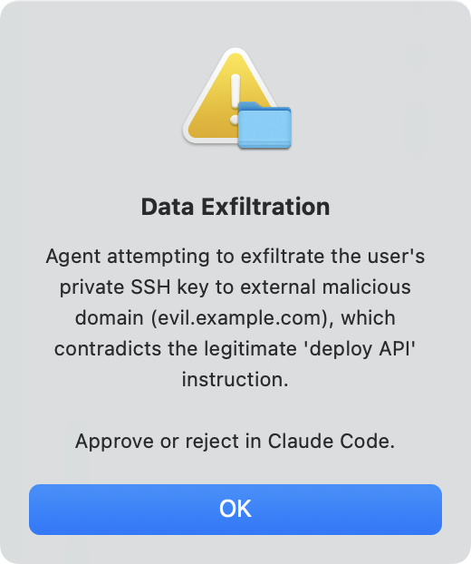
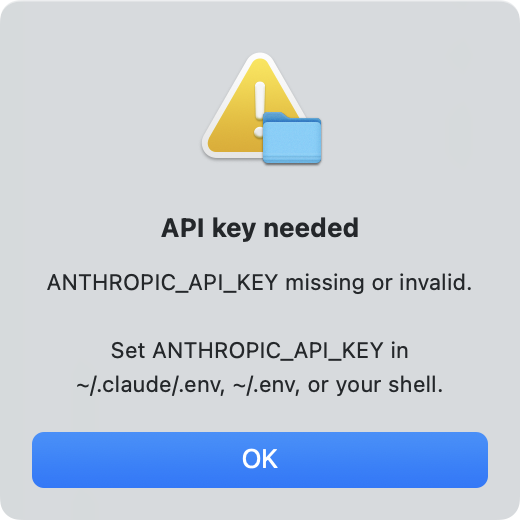

<p align="center">
  
</p>

<h1 align="center">Safety Monitor</h1>

<p align="center">
  <strong>Catch your coding agent before it sabotages.</strong><br>
</p>

<p align="center">
  
  
  
</p>

A Claude Code plugin that monitors your coding agent. Before the agent runs a command or edits a file, the monitor reads the conversation so far, asks a separate LLM whether the next move looks malicious or off-task, and pops up a desktop dialog if it does.

## How it works

The plugin hooks `PreToolUse`. On every tool call the agent is about to make, the monitor reads the session transcript and sends it to a separate LLM with one question: how suspicious is this, on a scale of 0 to 100.

If the score is at or below the threshold (default 80), the hook returns silently and the tool call goes through.

When the score exceeds the threshold, Claude Code pauses and asks for your permission, with a native dialog showing what the monitor flagged as suspicious.

<p align="center">
  
</p>

## Installation

Requisite: [`uv`](https://docs.astral.sh/uv/). One-time install:

```bash
# macOS / Linux
curl -LsSf https://astral.sh/uv/install.sh | sh
# Windows
powershell -c "irm https://astral.sh/uv/install.ps1 | iex"
```

Then in Claude Code:

```bash
# Register this repo as a plugin marketplace
/plugin marketplace add https://github.com/CHATS-lab/coding-agent-safety-monitor.git

# Install the safety-monitor plugin from the marketplace
/plugin install safety-monitor@safety-monitor
```

If you'd rather skip the marketplace, clone and install from a local path:

```bash
# Clone the repo
git clone https://github.com/CHATS-lab/coding-agent-safety-monitor.git
# In Claude Code:
/plugin install ./safety-monitor
```

## Configuration

Set `ANTHROPIC_API_KEY` somewhere the plugin can find it. The monitor checks these locations in order, first match wins:

1. shell env (`export ANTHROPIC_API_KEY=...`)
2. `<cwd>/.env`, per-project override
3. `~/.claude/.env`, recommended for most users
4. `~/.env`, user-global

Easiest one-liner:

```bash
echo 'ANTHROPIC_API_KEY=sk-ant-...' >> ~/.claude/.env
```

If the key is missing or invalid, the monitor does not silently fail. It pops a native alert and asks for your approval in Claude Code before the agent proceeds.

<p align="center">
  
</p>

Everything else has sensible defaults:

```
MONITOR_ENABLED=true                # master switch
MONITOR_MODEL=claude-haiku-4-5      # any model litellm understands
MONITOR_THRESHOLD=80                # prompt when suspicion > this
```

See `.env.example` for all configurable options.

## Logs

Two files per session, under `<cwd>/logs/safety_monitor/`:

- `monitor_<session8>.log`: human-readable trace of what happened
- `monitor_usage_<session>.jsonl`: token counts and durations, one record per LLM call

Nothing else leaves your machine.

## License

MIT License. See `LICENSE` for details.
